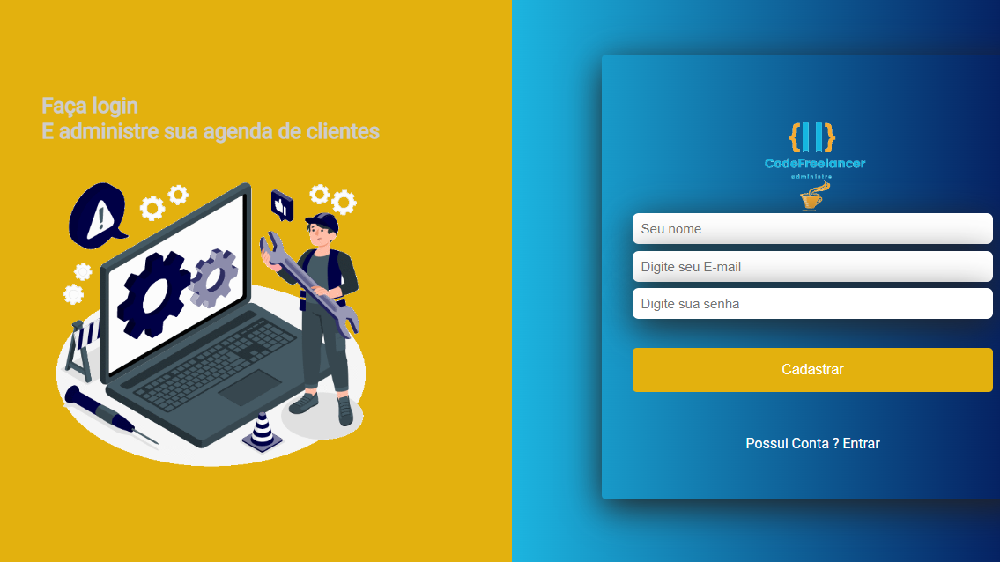

<h1 align='center'>
    <p>CodeFreelancer!</p>
    <p>Acesse : https://code-freelancer-iwkx7fabg-joaollucaxs.vercel.app/</p>
    
    <h2>Utilize o email : testeteste@gmail.com , senha:testando</h2>
    
</h1>


##Sobre o CodeFreelancer - 

💻 Projeto desenvolvido com CRA , codefreelancer foi um projeto criado com base em desenvolvedores freelancer que precisam administrar vários projetos ao mesmo tempo e gerencialos

💻 Project developed with CRA , codefreelancer was a project created based on freelancer developers who need to manage multiple projects at the same time

## Tecnologias usadas ⛏ 

•React.Js

•Styled Components

•Firebase

•date-fns

•React-icons

•Router-Dom

## Contribue ♻
```bash
#Clone o projeto - Clone the project
$ git clone
```

```bash
#Install
$ npm install
$ npm install styled-components
$ npm install date-fns
$ npm install react-icons
$ Não esqueça de instalar o react-router-dom / Don't forget to install react-router-dom
```
<p align='center'> Or</p>

```bash
$ yarn
```

<h1 align='center'>
    
    
    <p>CodeFreelancer!</p>
</h1>
