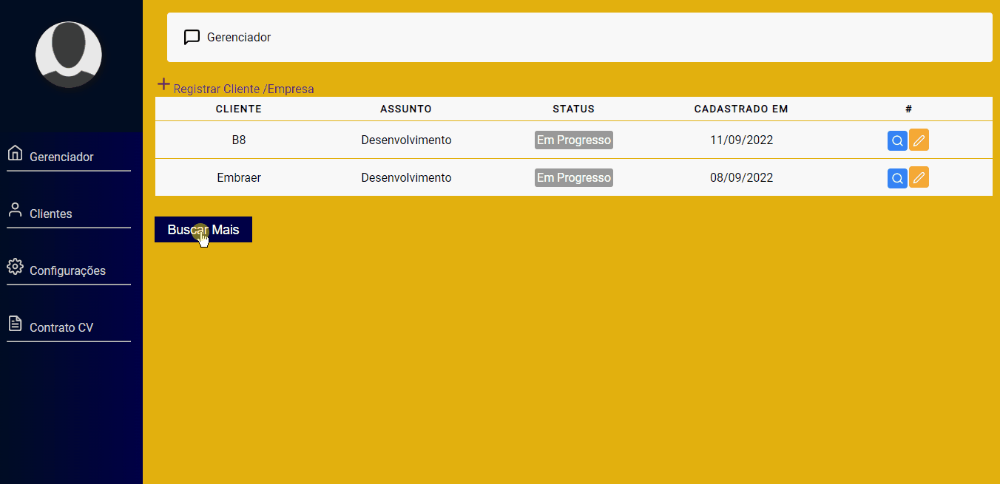

<h1 align='center'>
    <p>CodeFreelancer!</p>
</h1>


##Sobre o CodeFreelancer - 

⭐⚡ Codefreelancer foi um projeto criado com base em desenvolvedores freelancer que precisam administrar vários projetos ao mesmo tempos e gerencialos nele você é capaz de adicionar foto, adicionar seus projetos e detalhes dele, progresso do projeto, e de quebra deixei disponível dois tipos de contratos para você baixar.

⭐⚡ Codefreelancer was a project created based on freelance developers who need to manage several projects at the same time and manage them in it you are able to add a photo, add your projects and details of it, project progress, and besides, I left two types of contracts available for you to go down.

## Tecnologias usadas ⛏ 

•React.Js

•Styled Components

•Firebase

•date-fns

•React-icons

•Router-Dom

## Implementação na próxima Sprint ⛏ 
    • Cara nova, mudança de visual no início do projeto

    • Detalhes animados de login e senha
## Contribue ♻
```bash
#Clone o projeto - Clone the project
$ git clone
```

```bash
#Install
$ npm install
$ npm install styled-components
$ npm install date-fns
$ npm install react-icons
$ Não esqueça de instalar o react-router-dom
```
<p align='center'> Or</p>

```bash
$ yarn
```

<h1 align='center'>
    <p>Gif</p>
    
</h1>

<h1 align='center'>
     <p>Visualização</p>
    
    
</h1>