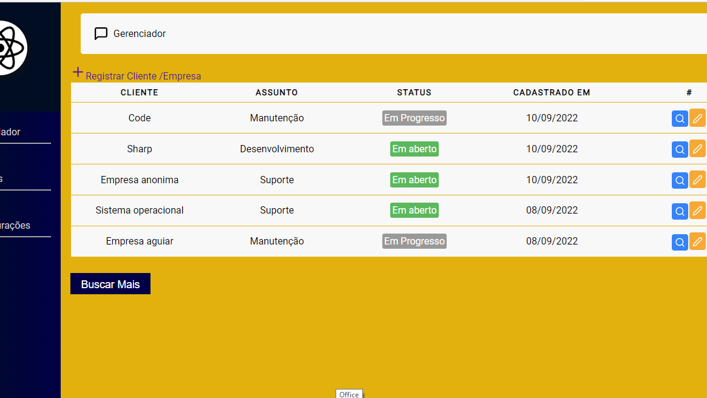

<h1 align='center'>
    <p>CodeFreelancer!</p>
</h1>


##Sobre o CodeFreelancer - 

Ajudar microempreendedores e pessoas em situação de vulnerabilidade econômica que queiram oferecer serviços digitais e não sabem organizar seus projetos.
## Tecnologias usadas ⛏ 

•React.Js

•Styled Components

•Firebase

•date-fns

•React-icons

•Router-Dom


## Atualização da próxima Sprint ⛏ 
    • Melhorias na página de contratos

## Contribue ♻
```bash
#Clone o projeto - Clone the project
$ git clone (url do projeto)
```

```bash
#Install
$ npm install
$ npm install styled-components
$ npm install date-fns
$ npm install react-icons
$ Não esqueça de instalar o react-router-dom / Don't forget to install react-router-dom
```
<p align='center'> Or</p>

```bash
$ yarn
```

<h1 align='center'>
    
     
    
</h1>
